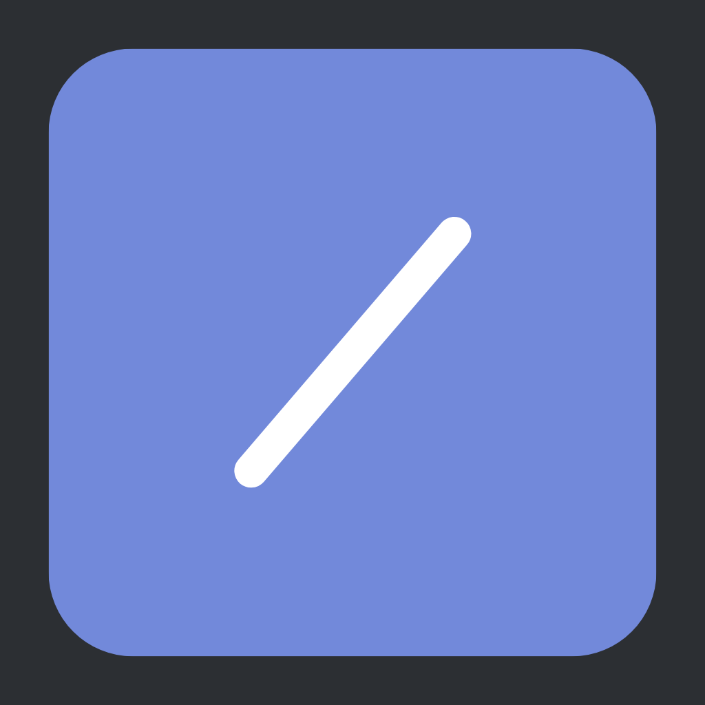

# Slash Suggestion Bot

[](https://github.com/sujalgoel/slash-suggestion-bot/blob/master/LICENSE)

> A suggestion bot with Discord Slash Commands

## Configuration Example

```js
module.exports = {
	token: 'DISCORD_BOT_TOKEN',
	prefix: '!',
	suggestion_channelID: 'SUGGESTION_CHANNEL_ID',
	mongo_url: 'mongodb://localhost:27017/sujal',
	developer_role: 'DEVELOPER_ROLE_ID',
};
```

## Package Installation

Discord Levelling Bot requires [Node.js](https://nodejs.org/) to run.


```sh
$ cd slash-suggestion-bot
$ npm install
$ npm run start
```

## Usage

1. Grab source by either using Git to clone or by [`downloading!`](https://github.com/sujalgoel/slash-suggestion-bot/archive/master.zip)
2. Run `npm i` to install dependencies.
3. Rename [`example.config.js`](https://github.com/sujalgoel/slash-suggestion-bot/blob/master/example.config.js) to `config.js` and replace the marked fields with the proper credentials.
4. Now run `npm run start` to start the application!
5. Go to Discord and test your bot.


## **Creators** 💖

- Sujal Goel#0302
